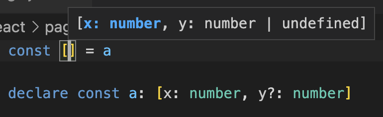
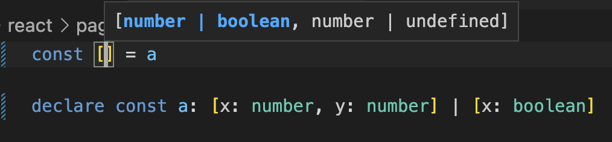
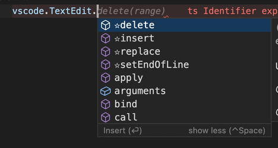
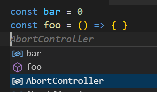
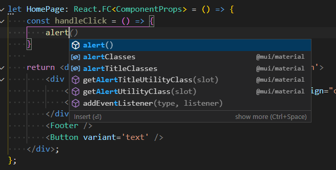

# TypeScript Essential Plugins

**Use next-Gen TypeScript features in VSCode today!**

No-AI smart predictable completions that efficiently reuses the world of types!

- Stays fast
- No internet connection required

Feature-complete TypeScript plugin that improves every single builtin feature such as completions, definitions, references and so on, and also adds even new TypeScript killer features, so you can work with large codebases faster!
We make completions more informative. Definitions, references (and sometimes even completions) less noisy. And finally our main goal is to provide most customizable TypeScript experience for IDE features.

## TOC

- [Top Features](#top-features)
- [Minor Useful Features](#minor-useful-features)
- [Method Snippets](#method-snippets)
- [Volar (Vue) Support](#vue-support)
- [Auto Imports](#auto-imports)
- [Type Driven Completions](#type-driven-completions)
- [Special Commands List](#special-commands-list)
- [Contributed Code Actions](#contributed-code-actions)
- [Rename Features](#rename-features)
- [Even Even More](#even-even-more)

> *Note*: You can disable all optional features with `> Disable All Optional Features` command just after installing.
>
> *Note*: Visit website for list of recommended settings: <https://ts-plugin.zardoy.com/>

## Top Features

> Note: With this plugin React experience hits different! (see below)

### Special Commands & Actions

See [special commands list](#special-commands-list) ans [code actions list](#contributed-code-actions)

### JSX Outline

(*disabled by default*) Enable with `tsEssentialPlugins.patchOutline`

Add JSX elements to outline. It also makes sticky scroll works with your tags!

Super recommended for react. Fragments are not rendered.

Also is not supported in the web.

## **Completions Built Different**

90% work done in this extension highly improves completions experience!

### Strict JSX Emmet

(*enabled by default*) when react langs are in `emmet.excludeLanguages`

Emmet that is active **only** inside JSX tags!

You can force enable this by using `Enable Strict Emmet in JSX` command.

*Why?* Issues it fixes: [query](https://github.com/microsoft/vscode/issues?q=sort%3Aupdated-desc+51537+150671+142978+119736).

#### Optional Emmet Features

- cleanup suggestions (can be enabled `jsxEmmet.modernize`)
- override `.` snippet

Is not supported in the web for now.

### Array Method Snippets

(*disabled by default*)

Edits array suggestions that receive predicate in the following way:

```ts
const usersList = []

usersList.map // -> usersList.map((user) => )
```

### Locality Bonus

(*disabled by default*, SUPER recommended, enable with `suggestions.localityBonus`)

Suggestions closer to cursor will appear higher, useful for local variables (eg callback parameters), requires TS >=5.0

Why not enable built-in *Locality Bonus* setting:

- Sometimes it just doesn't work
- In other cases it might lead to misleading suggestions (as it's text-based and not smart)

### Case-sensitive Completions

(*disabled by default*)

Filter out completions that start with different casing.

### Tuple Type Signatures

(*disabled by default*, but super recommended)

Completions and signature help in tuple literal expressions & destructure.




### Remove Definition From References

(*enabled by default*)

<https://github.com/microsoft/vscode/issues/160637>

### Remove Imports From References

(*enabled by default*)

Removes import statements from references when symbol has usages in the same file. Why? Because if export thing is used in another file, it might be obvious that it is imported, and most probably you are not interested in import statements.

## Minor Useful Features

### `enablePlugin` setting

You can quickly disable this plugin functionality by setting this setting to false. Useful for debugging a problem for example.

> Note: this setting doesn't disable Vue support.

### Vue Support

`.vue` SFC files support is disabled, but can be enabled with setting and when [Vue Language Features (Volar)](https://marketplace.visualstudio.com/items?itemName=Vue.volar) is installed.

Enable now: `"tsEssentialPlugins.enableVueSupport": true` (if you're not using local `./volar.config.js`)

For the first time, it will configure `volar.vueserver.configFilePath` setting.

This also makes plugin work in Volar's takeover mode!

### Web Support

> Note: when you open TS/JS file in the web for the first time you currently need to switch between editors to make plugin work.

There is web-only feature: fix clicking on relative `import` paths.

Alternative you can try to use [vscode-typescript-web extension](https://github.com/volarjs/vscode-typescript-web/) for better web intellisense.

### `in` Keyword Suggestions

[Demo](https://github.com/zardoy/typescript-vscode-plugins/pull/19)

### Highlight non-function Methods

(*enabled by default*)

Highlights non-function methods and properties. Also applies for static class methods.



### Indexed Signature Completions

```ts
const bannedUsers = {
    admin: false,
    moderator: false,
}
bannedUsers[condition ? 'admin' : 'moderator'] = true
//          adds suggestions ^      ^ deranks admin suggestion
```

### Remove Useless Code Fixes

(*enabled by default*)

By default removes `Fix Missing Function Declaration` codefix. Possibly to remove more via setting.

### Remove Useless Function Props

(*enabled by default*)

Removes `Symbol`, `caller`, `prototype` completions on function / classes.

### Keywords Insert Text

(*enabled by default*)

Appends *space* to almost all keywords e.g. `const `, like WebStorm does.

### Patch `toString()`

(*enabled by default*)

Patches `toString()` insert function snippet on number types to remove annoying tab stop.

### Restore Properties Sorting

(*disabled by default*) enable with `tsEssentialPlugins.fixSuggestionsSorting`

Try to restore [original](https://github.com/microsoft/TypeScript/issues/49012) properties sorting in some places such as object destructure & dot property access.

### File Extension Suggestions

We extend completion list with extensions from module augmentation (e.g. `.css` files if you have `declare module '*.css'`).
But for unchecked contexts list of extensions can be extended with `tsEssentialPlugins.additionalIncludeExtensions` setting.

### Mark Code Actions

(*enabled by default* with two settings)

Mark all TS code actions with `🔵`, so you can be sure they're coming from TypeScript, and not some other extension.

### Additional Types Suggestions

```ts
// Adds types in default constraint:
type A<T extends 'foo' | 'bar' = ''> = ...
```

### Builtin Code Fix Fixes

With this plugin fixes some builtin code actions and these code fixes will work *correctly*:

```ts
// ctrl+s fix: only one async is added
const syncFunction = () => {
    await fetch()
    await fetch()
}
const a = 5
// const to let fix
a = 6
```

### Format Ignore Directives

We support [format ignore directives](https://github.com/microsoft/TypeScript/issues/18261)

## Type-Driven Completions

All in this section requires TypeScript nightly extension.

### JSX Elements

To Enable: `"tsEssentialPlugins.experiments.excludeNonJsxCompletions": true`

We can filter out completions so only Function Components stay in your list:

```tsx
class Foo {}
const Bar = () => <div />

const elem = </* Bar is suggested, Foo not
```

Super handy in MUI + Electron projects.

Class components are not supported (no need).

### Change kind to function

Enable with `tsEssentialPlugins.experiments.changeKindToFunction`



## Method Snippets

(*enabled by default*)

Expands arrow callback completions with signature snippet. Also adds additional undo stack!

Example:

```ts
const callback = (arg) => {}
callback -> callback(arg)
```

#### Configuration

There are value descriptions for two settings:

`tsEssentialPlugins.methodSnippets.insertText`:

```ts
const example = ({ a }, b?, c = 5, ...d) => { }

// binding-name (default)
example({ a }, b, c, ...d)
// always-declaration (also popular)
example({ a }, b?, c = 5, ...d)
// always-name
example(__0, b, c, d)
```

`tsEssentialPlugins.methodSnippets.skip`:

```ts
const example = ({ a }, b?, c = 5, ...d) => { }

// only-rest
example({ a }, b, c)
// optional-and-rest (default)
example({ a })
// all
example() // (cursor inside)
// no-skip (popular)
example({ a }, b, c, ...d)
```

`tsEssentialPlugins.methodSnippets.multipleSignatures`:

```ts
// overload 1
function foo(this: {}, a)
// overload 2
function foo(this: {}, b)
function foo(this: {}) {}

// pick-first (default)
foo(a)
// empty
foo(|)
```

`disableMethodSnippets.jsxAttributes`:

```tsx
const callback = (arg) => {}
function Foo() {
    return <div onClick={callback/* when true (default) - no expansion here */} />
}
```

`tsEssentialPlugins.methodSnippets.previewSignature`:

Optionally resolve insertText of all completion at suggest trigger:



### Ambiguous Suggestions

Some variables like `Object` or `lodash` are common to access properties as well as call directly:

```ts
Object.assign(...)
Object()
// or
lodash.version
lodash(...)
```

To not be annoying, we don't insert a method snippet on such suggestion accept.

Instead, for these *ambiguous* suggestions we require you to accept the same suggestion twice to ensure you actually want a method snippet.

## Auto Imports

With this plugin you have total (almost) control over auto imports that appear in completions, quick fixes and import all quick fix. Some examples of what you can do:

- I never want to see `join` suggestion from `path/win32` module (it's a Node.js [module](https://nodejs.org/dist/latest-v18.x/docs/api/path.html#pathwin32), defined via module augmentation)
- I never want to see any suggestions from `path/*` modules
- I always want `join` to be imported from `path/posix` module on window (also would appear first in completions & single quick fix)
- I always want `useState` to be imported from local files first

Some settings examples:

<!-- just duplicated from configurationType -->

```jsonc
"suggestions.ignoreAutoImports": [
  "path", // ignore path, but not path/posix or path/win32 modules
  "path/*", // ignore path, path/posix and path/win32
  "path/*#join", // ignore path, path/posix and path/win32, but only join symbol
  "path/*#join,resolve", // ignore path, path/posix and path/win32, but only join and resolve symbol
],
"autoImport.changeSorting": {
    "join": ["path/posix"], // other suggestions will be below
    "resolve": ["*", "path/posix"], // make `path/posix` appear below any other suggestions
    "useState": ["."], // `.` (dot) is reserved for local suggestions, which makes them appear above other
},
// for some even more specific cases?
// "autoImport.alwaysIgnoreInImportAll": ["lodash"] // exclude all possible imports from import all request
```

> Note: changeSorting might not preserve sorting of other existing suggestions which not defined by rules, there is WIP
> Also I'm thinking of making it learn and sync most-used imports automatically

### Namespace Imports

If you always want some modules to be imported automatically as namespace import, you're lucky as there is `autoImport.changeToNamespaceImport` setting for this.

Example:

You're completing following Node.js code in empty file:

```ts
readFileSync
```

Default completion and code fix will change it to:

```ts
import { readFileSync } from 'fs'

readFileSync
```

But if you setup this setting:

```json
"tsEssentialPlugins.autoImport.changeToNamespaceImport": {
    "fs": {},
},
```

Completing the same code or accepting import code fix will result:

```ts
import * as fs from 'fs'

fs.readFileSync
```

There is also a way to specify different name for namespace or use default import instead.

However there are cases where you have some modules injected globally in your application (e.g. global `React` variable), then you can specify *auto imports feature* to use them instead of adding an import:

```json
"tsEssentialPlugins.autoImport.changeToNamespaceImport": {
    "react": {
        "namespace": "React",
        "addImport": false
    },
},
```

`useState` -> `React.useState`

## Rename Features

There is builtin mechanism to rename variable occurrences in strings & comments, it is disabled in VS Code without a way to enable it.

However this extension also has builtin keybinding `Ctrl+Shift+Enter` that can be pressed when input box is visible to enable aforementioned behavior for renaming with preview.

But note renaming in strings & comments will happen only for files in which variable is actually referenced.

You can add this to `keybindings.json` to disable previewing before renaming:

```js
{
    "key": "ctrl+shift+enter",
    "command": "tsEssentialPlugins.acceptRenameWithParams",
    "args": {
        "strings": true,
        "comments": true,
        // "preview": true // true by default
        // "alias": true // you can also specify here wether to introduce alias on rename if applicable (overriding global setting)
    },
    "when": "renameInputVisible"
}
```

> Note: VS Code has builtin setting to disable introducing aliases (e.g. for imports & object properties): `typescript.preferences.useAliasesForRenames`

## Special Commands List

### Go to / Select Nodes by Kind

Extremely powerful command that allows you to leverage AST knowledge of opened file.

Use cases: select all comments to exclude searching in comments. Or search & replace only within strings / find interested JSX attribute node.

## Contributed Code Actions

### Swap Keys and Values in Object

> *Note*: Code action displayed **only** when object is fully explicitly selected

Example:

```ts
const obj = {
    key1: 'someValue',
    key2: getSuperUniqueKey()
}
// turns into
const obj = {
    'someValue': 'key1',
    [getSuperUniqueKey()]: 'key2'
}
```

### Turn Array Into Object

```ts
const data = [
    {
        // test
        key: 'bar',
        a: 0
    },
    {
        key: 'baz',
        // yes
        b: 1
    }
]
```

After selecting code action, you'll get asked for key to used (here you can use only `key`) and after applying:

```ts
const a = {
    'bar': {
        a: 0
    },
    'baz': {
        // yes
        b: 1
    }
}
```

(note that for now refactoring removes properties with comments!)

## Even Even More

Also please take a look at extension settings, as this extension has much more features than described here!
